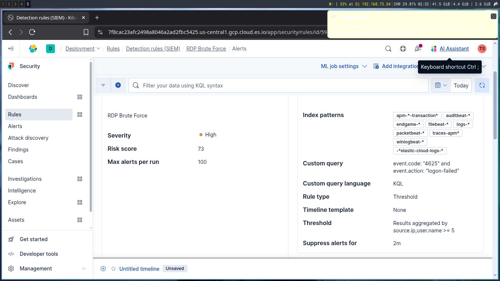
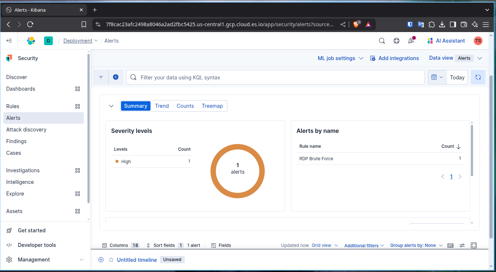

# Lateral Movement via RDP Brute Force

##  Scenario Description

  An attacker uses  low-privilege user credentials to perform brute force attempts on RDP (Remote Desktop Protocol) connections across multiple servers within the network. This technique attempts to gain lateral movement by guessing passwords or leveraging credential stuffing to access additional systems.
## Objective

  Detect potential brute force attempts over RDP by monitoring multiple failed login attempts from the same source IP or user account targeting different servers, followed by a successful login indicating possible credential compromise and lateral movement.
## Windows Event IDs

| Event ID | Description                                      |
| -------- | ------------------------------------------------ |
| 4625     | Failed login attempt                             |
| 4648     | A logon was attempted using explicit credentials |
| 4624     | Successful account logon                         |
| 1149     | Remote Desktop Services logon attempt            |


## Detection Logic / Query

```sql
event.code: "4625" and event.action: "logon-failed"
```


## Sample Alert Screenshot



## Logs or Sample Event

```json
"@timestamp","event.action","process.command_line","event.code","destination.port","source.port","network.transport"
"Jun 13, 2025 @ 13:21:59.711","logon-failed","-",4625,"-",0,"-"
```
## Detection Status

  - [ ] Detection Tested 
  - [ ]  Alert Triggered 