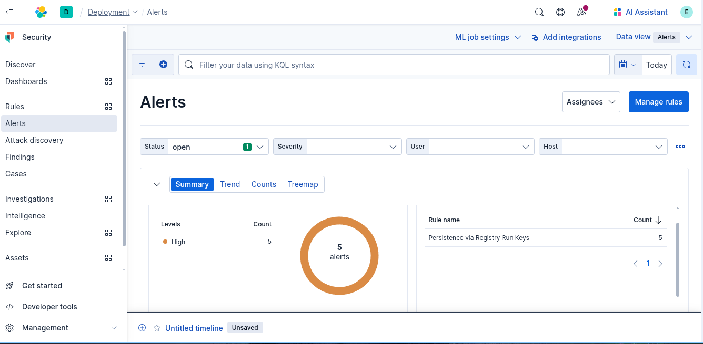

# Persistence via Registry Run Keys

##  Scenario Description

  An attacker has gained access to a Windows machine and wants to maintain persistence across system reboots. To achieve this, they modify specific Windows Registry "Run" keys to execute a malicious script or binary each time the system starts. This technique is commonly used by malware and attackers to reinfect the host even after a system reboot[more](https://pentestlab.blog/2019/10/01/persistence-registry-run-keys/).
## Objective

  Detect unauthorized or suspicious additions to Windows Registry Run keys that may indicate persistence mechanisms being set up by a threat actor.

## Windows Event IDs

| Event ID | Description                                                                                                |
| -------- | ---------------------------------------------------------------------------------------------------------- |
| 13       | [RegistryEvent](https://www.ultimatewindowssecurity.com/securitylog/encyclopedia/event.aspx?eventid=90013) |
## Detection Logic / Query

```sql
host.os.name: "Windows" and event.type: "change" and registry.data.strings: * and registry.path: (
  "HKEY_USERS\\*\\Software\\Microsoft\\Windows\\CurrentVersion\\Run" or
  "HKU\\*\\Software\\Microsoft\\Windows\\CurrentVersion\\Run" or
  "HKLM\\Software\\Microsoft\\Windows\\CurrentVersion\\Run" or
  "HKLM\\Software\\WOW6432Node\\Microsoft\\Windows\\CurrentVersion\\Run" or
  "HKEY_USERS\\*\\Software\\Microsoft\\Windows\\CurrentVersion\\Policies\\Explorer\\Run" or
  "HKU\\*\\Software\\Microsoft\\Windows\\CurrentVersion\\Policies\\Explorer\\Run" or
  "\\REGISTRY\\MACHINE\\Software\\Microsoft\\Windows\\CurrentVersion\\Policies\\Explorer\\Run" or
  "\\REGISTRY\\USER\\*\\Software\\Microsoft\\Windows\\CurrentVersion\\Run" or
  "\\REGISTRY\\MACHINE\\Software\\Microsoft\\Windows\\CurrentVersion\\Run" or
  "\\REGISTRY\\MACHINE\\Software\\WOW6432Node\\Microsoft\\Windows\\CurrentVersion\\Run" or
  "\\REGISTRY\\USER\\*\\Software\\Microsoft\\Windows\\CurrentVersion\\Policies\\Explorer\\Run" or
  "\\REGISTRY\\MACHINE\\Software\\Microsoft\\Windows\\CurrentVersion\\Policies\\Explorer\\Run"
)
```
## Sample Alert Screenshot




## Logs or Sample Event

```powershell
@timestamp,host.name,event.code,event.action,registry.key,registry.value,registry.data,process.name,process.path,user.name
2025-06-04T06:15:23.123Z,WIN-EXAMPLE,13,Registry value set,HKLM\Software\Microsoft\Windows\CurrentVersion\Run,revershell,"powershell.exe -ExecutionPolicy Bypass -File C:\payload.ps1",reg.exe,C:\Windows\System32\reg.exe,NT AUTHORITY\SYSTEM
```
## Detection Status

  - [ ] Detection Tested 
  - [ ]  Alert Triggered 