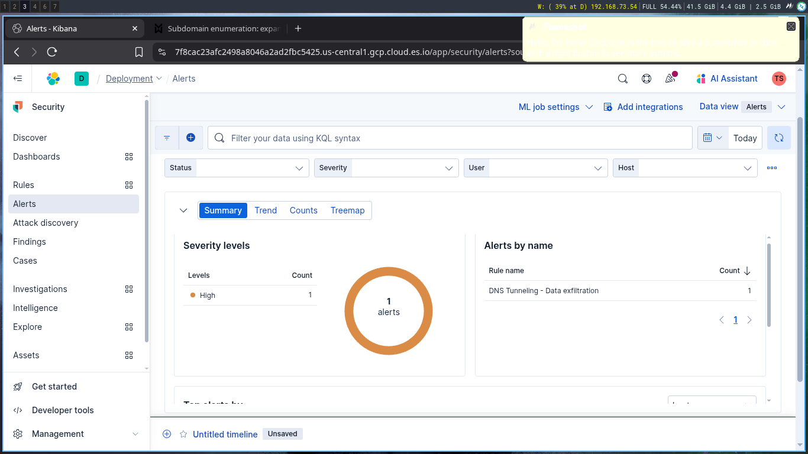

# DNS Tunneling - Data exfiltration

## Objective

  Detects unusually large numbers of DNS queries for a single top-level DNS domain, which is often used for DNS tunneling. DNS tunneling can be used for command-and-control, persistence, or data exfiltration activity. For example, `dnscat` tends to generate many DNS questions for a top-level domain as it uses the DNS protocol to tunnel data.
## Windows Event IDs

| Event ID | Description                                                                                |
| -------- | ------------------------------------------------------------------------------------------ |
| **22**   | **DNS query** logged with `QueryName`, `Image`, and more. Crucial for tunneling detection. |

## Detection Logic / Query

```sql
event.code: "22" and (
  winlog.event_data.QueryName: "*.oast.site" or
  winlog.event_data.QueryName: "*.live" or
  winlog.event_data.QueryName.keyword: "*=*"
)
```
## Sample Alert Screenshot


## Logs or Sample Event

```sql
@timestamp,event.code,Image,QueryName,User,Computer
2025-06-13T14:20:45Z,22,C:\Windows\System32\nslookup.exe,aGVsbG8gdGhlcmUgaSB0cnkgdGVzdGluZyA=.d163knb70n71ipbqb3c061ieukueeeu15.oast.live,LAB\Administrator,WIN-EC2-01
2025-06-13T14:20:46Z,22,C:\Windows\System32\nslookup.exe,cGFzc3dvcmQxMjM=.d163knb70n71ipbqb3c061ieukueeeu15.oast.live,LAB\Administrator,WIN-EC2-01

```
## Detection Status

  - [ ] Detection Tested 
  - [ ]  Alert Triggered 