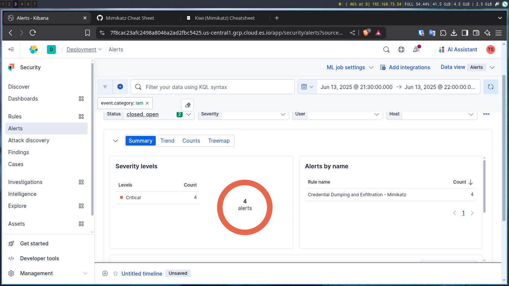

# Credential Dumping and Exfiltration - Mimikatz

## Scenario Description

  Credential dumping is a common post-exploitation technique where attackers extract credentials from memory to escalate privileges or move laterally across a network. Mimikatz is a widely used tool by attackers to dump credentials from the Local Security Authority Subsystem Service (LSASS) on Windows systems. After dumping, attackers often exfiltrate stolen credentials or hashes, commonly over HTTPS to evade detection.
## Objective

Detect and alert on **potential credential dumping activity using Mimikatz**, with a focus on:
- **LSASS memory access attempts**
- **Sensitive registry key access** related to credential storage
- **Vault or SAM extraction behavior**

This detection relies on Elastic Security's **Endpoint Security integration** (part of the Elastic Agent),
## Detection Logic / Query
```sql
event.category : "process" and 
event.action : "vault-credentials-were-read" and 
process.name : ("mimikatz.exe" or "procdump.exe" or "lsass.exe")
```

## Sample Alert Screenshot



## Logs or Sample Event

```sql
@timestamp,host.name,user.name,process.name,process.command_line,event.action,event.category,event.code,event.outcome
2025-06-13T21:46:59.503Z,WIN-EC2-TEST,Administrator,sli.exe,"mimikatz privilege::debug",vault-credentials-were-read,process,4103,success
2025-06-13T21:47:02.102Z,WIN-EC2-TEST,Administrator,sli.exe,"mimikatz vault::list",vault-credentials-were-read,process,4103,success

```
## Detection Status

  - [ ] Detection Tested 
  - [ ]  Alert Triggered 